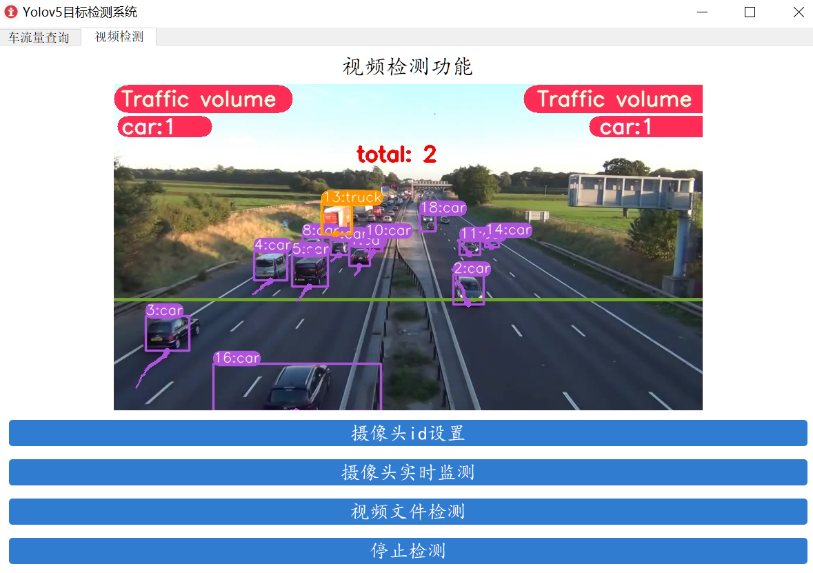

# Yolov5-Deepsort 车流量检测系统

基于 YOLOv5 目标检测和 DeepSORT 多目标跟踪的车流量统计系统，提供 PyQt5 图形界面，支持摄像头实时检测和视频文件检测，检测结果自动存入 SQLite 数据库，并支持按摄像头编号和时间段查询历史车流量。



## 功能特性

- **实时检测**：支持摄像头（0-3）实时画面检测
- **视频检测**：支持 MP4/AVI 视频文件检测
- **目标跟踪**：基于 DeepSORT 实现车辆多目标跟踪，分配唯一 ID
- **车流量统计**：在画面 66% 高度处设置计数线，按方向（南/北）统计车辆数量
- **数据存储**：检测结果按分钟存入 SQLite 数据库，记录时间戳、车流量、摄像头编号
- **历史查询**：支持按摄像头编号 + 时间段查询历史车流量
- **摄像头信息**：支持按摄像头编号查询地理位置信息

## 项目结构

```
Yolov5-Deepsort/
├── ui2.py                  # 主界面（PyQt5 GUI）
├── tools.py                # 工具类（DatabaseManager + TrackerUtils）
├── tracker.py              # DeepSort 追踪器封装（DeepSortTracker）
├── AIDetector_pytorch.py   # YOLOv5 检测器（Detector）
├── demo.py                 # 命令行检测示例
├── main.py                 # 数据库读取工具
├── traffic_data.db         # SQLite 数据库
├── requirements.txt        # 依赖列表
│
├── models/                 # YOLOv5 模型定义
│   ├── yolo.py             #   YOLO 网络结构
│   ├── common.py           #   通用模块（Conv, Bottleneck, SPP 等）
│   ├── experimental.py     #   模型加载（attempt_load）
│   └── yolov5*.yaml        #   各版本架构配置
│
├── utils/                  # YOLOv5 工具
│   ├── BaseDetector.py     #   基础检测器（baseDet）
│   ├── general.py          #   NMS、坐标缩放等
│   ├── datasets.py         #   数据加载、letterbox
│   └── torch_utils.py      #   设备选择等
│
├── deep_sort_pytorch/      # DeepSORT 实现（PyTorch 版，默认）
│   ├── configs/deep_sort.yaml  # 配置文件
│   └── deep_sort/
│       ├── deep_sort.py    #   DeepSort 主类
│       ├── deep/           #   Re-ID 特征提取（ckpt.t7）
│       └── sort/           #   卡尔曼滤波、匈牙利匹配、IOU
│
├── deep_sort/              # DeepSORT 实现（可选，通过 tracker.py 切换）
│   ├── configs/deep_sort.yaml
│   └── deep_sort/
│       ├── deep_sort.py
│       ├── deep/
│       └── sort/
│
├── weights/                # 预训练权重
│   ├── yolov5n.pt          #   YOLOv5-nano（默认使用）
│   └── yolov5s.pt          #   YOLOv5-small
│
├── font/
│   └── platech.ttf         # 中文字体（用于画面文字叠加）
│
├── images/
│   ├── UI/                 #   界面图标
│   └── tmp/                #   检测过程中临时保存的帧图片
│
└── video/                  # 测试视频
```

## 环境要求

- Python 3.7+
- PyTorch 1.7+
- CUDA（推荐，用于加速推理）

## 安装

```bash
# 1. 克隆项目
git clone https://github.com/your-username/Yolov5-Deepsort.git
cd Yolov5-Deepsort

# 2. 安装依赖
pip install -r requirements.txt
```

### requirements.txt 主要依赖

```
torch>=1.7.0
torchvision>=0.8.0
opencv-python>=4.1.0
PyQt5>=5.15.0
numpy>=1.18.0
Pillow>=7.0.0
```

## 使用方法

### 启动 GUI

```bash
python ui2.py
```

启动后进入图形界面，包含两个标签页：

#### 车流量查询

1. 点击 **"摄像头id"** 按钮，选择摄像头编号（0-3）
2. 点击 **"时间段"** 按钮，可通过快捷按钮（今天、昨天、最近3天、最近7天、最近30天、本月）快速选择，也可手动调整时间
3. 点击 **"车流量查询"** 按钮，显示该时间段内的总车流量、摄像头序号和地理位置
4. 点击 **"摄像头序号查询"** 按钮，输入摄像头编号查询其地理位置

#### 视频检测

1. 点击 **"摄像头id设置"** 按钮，选择要使用的摄像头编号
2. 点击 **"摄像头实时监测"** 开启摄像头检测，或点击 **"视频文件检测"** 选择本地视频文件
3. 检测过程中画面实时显示车辆检测框、跟踪 ID 和车流量统计
4. 点击 **"停止检测"** 停止当前检测

### 命令行检测

```bash
python demo.py
```

对 `video/test3.mp4` 进行检测，输出结果保存为 `result.mp4`，同时将车流量数据写入数据库。

## 数据库结构

使用 SQLite 数据库 `traffic_data.db`，包含两张表：

### traffic 表

| 字段 | 类型 | 说明 |
|------|------|------|
| id | INTEGER | 主键，自增 |
| timestamp | DATETIME | 时间戳（精确到分钟） |
| traffic_volume | INTEGER | 该分钟内的车流量 |
| camera_number | INTEGER | 摄像头编号 |

### cameras 表

| 字段 | 类型 | 说明 |
|------|------|------|
| camera_number | INTEGER | 摄像头编号 |
| location | TEXT | 地理位置 |

默认摄像头位置：

| 编号 | 位置 |
|------|------|
| 0 | 成化大道 |
| 1 | 枫林路 |
| 2 | 锦溪道 |
| 3 | 韶华路 |

## 核心代码架构

### 检测流程

```
摄像头/视频 → OpenCV 读帧 → YOLOv5 检测（Detector）
    → DeepSORT 跟踪（DeepSortTracker）
    → 画框 + 轨迹绘制（TrackerUtils.draw_boxes）
    → 车流量计数
    → 存入数据库（DatabaseManager）
    → 显示在界面
```

### 类关系

```
MainWindow (ui2.py)
├── DatabaseManager (tools.py)        # 数据库操作
├── TrackerUtils (tools.py)           # 工具函数
├── ImageUtils (ui2.py)               # 图像文字叠加
└── Detector (AIDetector_pytorch.py)  # YOLOv5 检测器
    └── baseDet (utils/BaseDetector.py)
        └── DeepSortTracker (tracker.py)  # DeepSORT 追踪器
            └── TrackerUtils (tools.py)
```

### 核心类说明

| 类名 | 文件 | 职责 |
|------|------|------|
| `MainWindow` | ui2.py | PyQt5 主界面，管理 UI 交互和业务逻辑 |
| `ImageUtils` | ui2.py | 图像文字叠加工具（静态方法） |
| `DatabaseManager` | tools.py | SQLite 数据库连接、建表、增删改查 |
| `TrackerUtils` | tools.py | 类别映射、轨迹绘制、车流量计数 |
| `DeepSortTracker` | tracker.py | DeepSORT 追踪器封装，负责目标跟踪 |
| `Detector` | AIDetector_pytorch.py | YOLOv5 检测器，仅检测车辆类别 |
| `baseDet` | utils/BaseDetector.py | 检测器基类，串联检测和跟踪流程 |

### 关键参数

| 参数 | 值 | 说明 |
|------|-----|------|
| 检测模型 | yolov5n.pt | YOLOv5-nano，轻量快速 |
| 检测类别 | bus, car, truck | 仅检测车辆 |
| 检测阈值 | 0.3 | 置信度阈值 |
| 计数线位置 | 画面高度 66% | 水平计数线 |
| 计数器重置 | 120 秒 | 每 2 分钟自动重置计数 |
| DeepSORT MAX_AGE | 70 | 目标丢失后保留帧数 |
| DeepSORT N_INIT | 3 | 新目标确认所需帧数 |

## DeepSORT 配置

### 切换 DeepSORT 后端

项目中包含两套 DeepSORT 实现，可在 `tracker.py` 顶部切换：

```python
# 使用 deep_sort_pytorch（默认）
DEEPSORT_BACKEND = "deep_sort_pytorch"

# 或切换为 deep_sort
DEEPSORT_BACKEND = "deep_sort"
```

两套实现接口完全一致，切换后功能不受影响。

### 配置参数

切换后端后，对应的配置文件会自动选择：

| 后端 | 配置文件 | ReID 权重 |
|------|---------|----------|
| `deep_sort_pytorch` | `deep_sort_pytorch/configs/deep_sort.yaml` | `deep_sort_pytorch/deep_sort/deep/checkpoint/ckpt.t7` |
| `deep_sort` | `deep_sort/configs/deep_sort.yaml` | `deep_sort/deep_sort/deep/checkpoint/ckpt.t7` |

配置参数（以 `deep_sort_pytorch` 为例）：

```yaml
DEEPSORT:
  REID_CKPT: "deep_sort_pytorch/deep_sort/deep/checkpoint/ckpt.t7"
  MAX_DIST: 0.2
  MIN_CONFIDENCE: 0.3
  NMS_MAX_OVERLAP: 0.5
  MAX_IOU_DISTANCE: 0.7
  MAX_AGE: 70
  N_INIT: 3
  NN_BUDGET: 100
```

## 训练自己的模型

参考 YOLOv5 官方文档训练自己的检测模型，训练完成后将权重文件放入 `weights/` 目录，并修改 `AIDetector_pytorch.py` 中的 `self.weights` 路径。

## 许可证

MIT License
